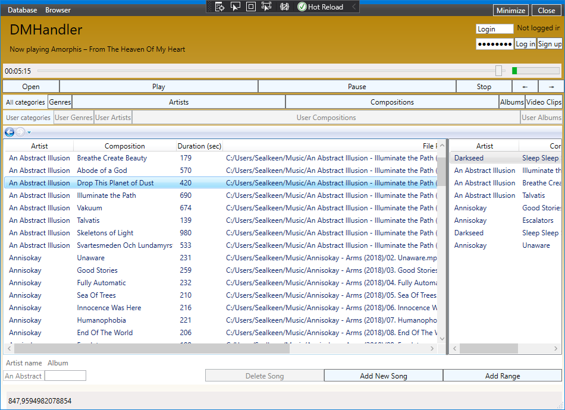

## Overview
### [SQLite, SQLServer] .Net (Core) based application aimed to support cross-platform audio streaming / listening experience.

### Right now the functional of the project is limited to:
- Music Explorer: Create music library and edit its content (e.g. tags, albums, genres, artists);
- Users data / Music Storage Database;
- ASP.NET Core WebServer / WebService with links to the music files stored on a remote server.
	

### Current versions support :
- WPF .Net Core 3.1 (.Net 6+) builds for Windows;
- Web API and MediaStreamer using json, ASP.Net Core 8.0 (No source code shared, only web server running).
- NetStandard Xamarin Forms / MAUI several component's support (in development);
-  ~~WPF .Net 4.0 builds for Windows~~ .Net Framework 4.0 support removed.

## Usage - output:
- CrossPlatfrom JSON Db build (.Net 6) is available without any connection string specified
  (uses current user's AppData directory + \/MediaStreamer);
– Compile the application using Visual Studio for your target platform using the MediaStreamer.UI project. 
– Debug the code so that it is running fine on your target platform;
- Run MediaStreamer.WPF.NetCore3.1 / FirstFMCourse.exe from build directory.
- Specify your own database path in the constructor of DMEntities for NetCoreApp3.1 / NetStandard2.1
- ~~Specify your own database path in "..\MediaStreamer\MediaStreamer.DataAccess.Net40\App.config" connection string for net40;~~

## Current Tasks (TODO's):

### Overall //TODO: 
- (In Progress) Refactor into separate Methods those that consist more than of 16-21 lines;
- (In Progress) Delete unused code (if it's obsolete / not working);
- (In Progress) Connect WebScrobbler from Last.FM and its WEB APIs;
- (Done) Implement "Return to previous state (Composition / Player Position)" when application's closed and re-opened;
– (In Progress) Implement fine logging and CrossPlatform desktop and mobile UI.
	
### WPF.Components:
- (In Progress) CompositionsPage: Fix "Rename to Standard" check menu item button -> enable renaming the file to match pattern "Artist – Title (Year if exists)".
	
### WPF.Net40 / WPFNetCore3.1 / DataAccess.Net40 / DataAccessNetCore3.1
- (Cancelled) Merge into single project WPF's with WPF Targeted net40 and netcoreapp3.1
	
### RAMControl (WPF/Components):
- Integrate the XamarinMediaManager into the Windows (WPF) Application for both Net40 (EF 6) and NetCore3.1 (EFCore 5);
- Connect WPFComponents with RAMControl (Exclude Program, Session, SessionInformation, FirstFMPage from WPF, add their references to RAMControl);
- Move CompositionStorage to RAMControl.
	
### XamarinForms:
- (v) Implement the "Player functionality" on "Browse" page:
		Stop, Pause, Next, Previous;
- Implement slider bar to scroll playing compositions;
- Implement "Queue" from XamarinMediaManager project (allow queueing compositions);
- Implement "Video" page in Xamarin Forms;
- Implement "ListenedCompositions / UserCompositions" Model, ViewModel, View 
- (Load ListenedCompositions from DataBase, register the user's composition into database when composition is playing, see the WPF project for example code).
	
### IO:
- Implement "Play several songs" cross-platformely with XamarinMediaManager (for ~~both .Net 4.0 and~~ .Net Core 3.1 (.Net 6)).

### DataAccess.CrossPlatform:
– (In Progress) Create a "restore previously played queue on startup" implementation;
– ...

